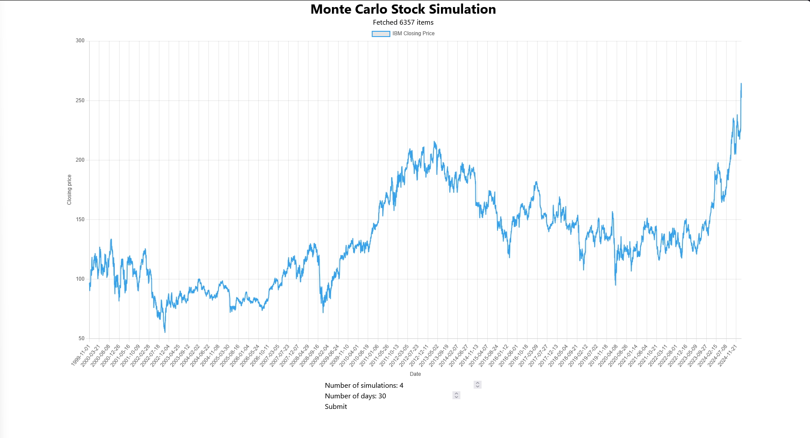
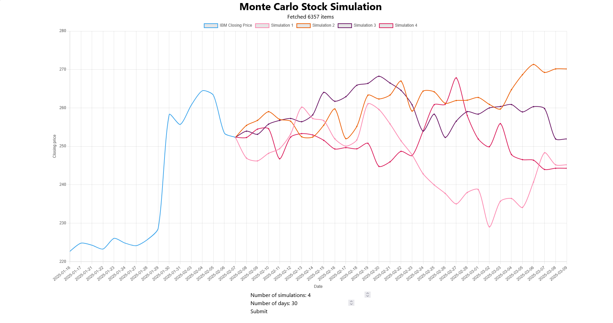
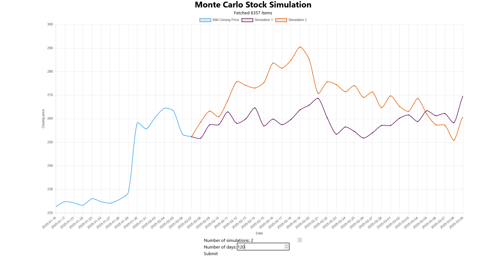

# Finance Simulator

This project runs a Monte Carlo simulation using Geometric Brownian Motion to generate potential future stock prices based
on historical data. The simulation is visualized via a web interface, allowing a user to see possible price movements for a 
given stock.

## Features
- **Monte Carlo Simulation** – Generates price paths using historical volatility and log returns.
- **Web Interface** – Displays historical stock data and simulation results using **Svelte** and **Chart.js**.
- **Thumper** – A lightweight **OCaml web server** built specifically for this project.
- **Spice** – A simple (and opinionated) **logging utility**.
- **Real-time Streaming** – Simulation results are streamed to the client as they are generated.

---

## Running the project

### Requirements
- OCaml and Dune
OR
- Docker

- A JavaScript package manager (for example, `pnpm`, `bun`, `npm`)

### Run
- First, the Javascript files need to be built
```bash
; pushd web
; <bundler> install
; <bundler> run build
; popd
```
- If you have OCaml (and Dune) installed, you can run with Dune
```bash
; dune exec finance_sim -- serve
```

- If you have Docker installed, you can run with Docker
```bash
; docker compose up
```

# Screenshots




## Next steps and limitations
- Graphing performance - Currently, simulated data is added to the graph slowly. Optimizing rendering performance is a priority.
- Stock selection - Right now the simulation only supports IBM stock data ending in early February 2025. Expanding stock selection is a future goal.
- UI enhancements - Improving the interface for a cleaner, more intuitive experience.

